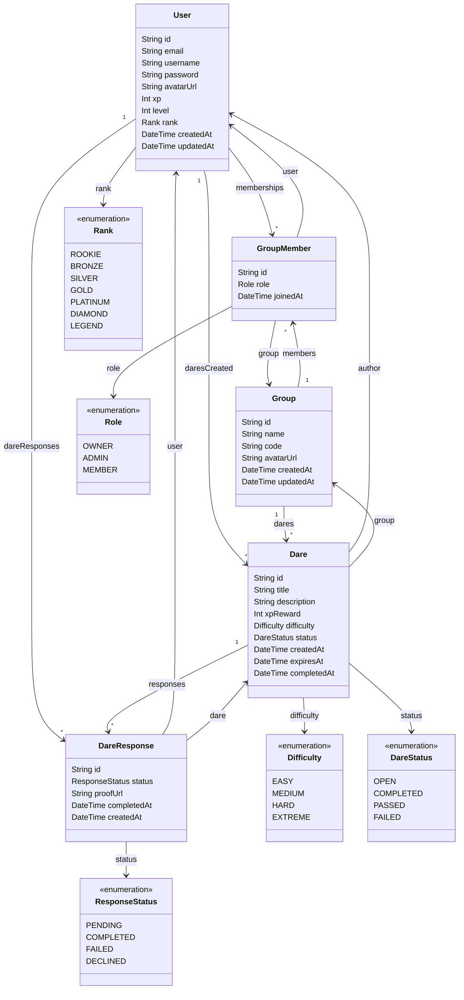

<h1 align="center">
  🎮 Dareo
</h1>

<p align="center">
  <strong>A gamified social dare platform — challenge your friends, earn XP, climb the leaderboard.</strong>
</p>

<p align="center">
  
  
  
  
  
  
  
  
</p>

---

## 📌 What is Dareo?

**Dareo** is a gamified social web app where friends create private groups and challenge each other with dares.

Players can create dares in their groups and **claim dares themselves** to earn XP. Each dare has a difficulty level and an XP reward. Players earn **XP** for completing dares, **level up** over time, and unlock **ranks** from Rookie to Legend.

> Friendly competition meets game-style progression in a dynamic, animated interface.

---

## ✨ Core Features

| Feature | Description |
|---|---|
| 👥 **Private Groups** | Create or join invite-only groups using unique group codes |
| 🎯 **Create Dares** | Create dares with title, description, difficulty, and XP reward |
| 🙋 **Self-Assign Dares** | Members claim open dares themselves (+5 XP for accepting) |
| ✅ **Complete Dares** | Mark dares as completed to earn the dare's full XP reward |
| ⏭️ **Pass / Fail** | Pass or fail a dare — costs 200% of the dare's XP as a penalty |
| ⭐ **XP & Points System** | Earn and lose XP based on dare outcomes |
| 📊 **Level Progression** | Level up every 10 XP — level = floor(XP / 10) |
| 🏆 **Ranking System** | 7 ranks from Rookie (0 XP) to Legend (700+ XP) |
| 🖼️ **Avatar Upload** | Upload custom profile avatars via UploadThing |
| ✏️ **Profile Editing** | Edit username, email, and avatar from the profile page |
| 🔐 **Authentication** | JWT-based auth with bcrypt password hashing |
| 🎮 **Game-style UI** | Dark theme with shadcn/ui components and smooth animations |

---

## 🎮 How the Game Works

### XP System

| Action | XP Change |
|---|---|
| **Claim a dare** (self-assign) | +5 XP |
| **Complete a dare** | + dare's XP reward |
| **Pass a dare** | −200% of dare's XP |
| **Fail a dare** | −200% of dare's XP |

> XP can never go below 0.

### Difficulty & XP Caps

| Difficulty | Default XP | Max XP |
|---|---|---|
| Easy | 10 | 25 |
| Medium | 25 | 50 |
| Hard | 50 | 100 |
| Extreme | 100 | 200 |

### Leveling

Level is calculated as `floor(XP / 10)` with a minimum of level 1. To reach level 2 you need 20 XP, level 3 needs 30 XP, and so on.

### Ranking System

| Rank | XP Required |
|---|---|
| 🟤 Rookie | 0 |
| 🥉 Bronze | 50 |
| 🥈 Silver | 150 |
| 🥇 Gold | 250 |
| 💎 Platinum | 350 |
| 💠 Diamond | 500 |
| 👑 Legend | 700 |

### Dare Lifecycle

```
Create Dare → Member Claims It (+5 XP) → Complete / Pass / Fail → XP Updated → Level & Rank Recalculated
```

### Dare Statuses

| Status | Description |
|---|---|
| `OPEN` | Dare is available to be claimed |
| `COMPLETED` | Assignee completed the dare — XP awarded |
| `PASSED` | Assignee passed on the dare — XP penalty |
| `FAILED` | Assignee failed the dare — XP penalty |

---

## 🗂️ Data Model



---

## 🛠️ Tech Stack

### Frontend

| Technology | Purpose |
|---|---|
| **React 19** | UI library with hooks and context API |
| **TypeScript 5.9** | Type-safe development |
| **Vite 7** | Build tool and dev server |
| **Tailwind CSS 4** | Utility-first styling |
| **shadcn/ui** (New York style) | Pre-built accessible UI components (Radix UI primitives) |
| **React Router 7** | Client-side routing with protected routes |
| **React Hook Form + Zod** | Form handling with schema validation |
| **Lucide React** | Icon library |
| **Recharts** | Chart components |
| **Sonner** | Toast notifications |
| **Vaul** | Drawer component |
| **Embla Carousel** | Carousel component |
| **UploadThing** | File upload (avatars) |

### Backend

| Technology | Purpose |
|---|---|
| **Express 5** | REST API server |
| **Prisma 7** | ORM with type-safe database access |
| **PostgreSQL** (Supabase) | Relational database |
| **JWT** (jsonwebtoken) | Authentication tokens |
| **bcryptjs** | Password hashing |
| **UploadThing** | Server-side file upload handling |

### Testing

| Technology | Purpose |
|---|---|
| **Vitest 4** | Test runner (integrated with Vite) |
| **React Testing Library** | Component testing with DOM queries |
| **@testing-library/user-event** | Simulating user interactions |
| **@testing-library/jest-dom** | Custom DOM matchers |
| **jsdom** | Browser environment for tests |

### Dev Tools

| Technology | Purpose |
|---|---|
| **ESLint** | Code linting |
| **Prettier** | Code formatting |
| **tsx** | TypeScript execution for the server |
| **concurrently** | Running client + server in parallel |

---

## 📁 Project Structure

```
dareo/
├── prisma/
│   └── schema.prisma          # Database schema (models, enums, relations)
├── server/
│   ├── index.ts                # Express server entry point
│   ├── db.ts                   # Prisma client setup
│   ├── uploadthing.ts          # File upload route handler
│   └── routes/
│       ├── auth.ts             # Sign-up, sign-in, JWT auth
│       ├── group.ts            # Groups, dares, XP, claiming, status
│       └── user.ts             # Profile updates
├── src/
│   ├── main.tsx                # App entry point with routing
│   ├── App.tsx                 # Landing page
│   ├── components/
│   │   ├── navbar.tsx          # Navigation bar (auth-aware)
│   │   └── ui/                 # shadcn/ui components (47 components)
│   ├── context/
│   │   └── auth-context.tsx    # Auth context provider (JWT + localStorage)
│   ├── hooks/
│   │   └── use-mobile.ts       # Mobile breakpoint detection hook
│   ├── lib/
│   │   ├── auth.ts             # Zod validation schemas (signUp, signIn)
│   │   ├── utils.ts            # Tailwind class merging utility (cn)
│   │   ├── xp.ts               # Shared XP/level/rank calculation helpers
│   │   └── uploadthing.ts      # UploadThing React hook
│   ├── pages/
│   │   ├── game.tsx            # Dashboard — list/create/join groups
│   │   ├── group.tsx           # Group detail — members, dares, actions
│   │   ├── profile.tsx         # User profile — avatar, stats, editing
│   │   ├── sign-in.tsx         # Sign-in form
│   │   └── sign-up.tsx         # Sign-up form with avatar upload
│   └── test/
│       └── setup.ts            # Vitest test setup (jest-dom matchers)
└── generated/
    └── prisma/                 # Auto-generated Prisma client & types
```

---

## 🚀 Getting Started

### Prerequisites

- **Node.js** 18+
- **PostgreSQL** database (or a Supabase project)

### Setup

```bash
# 1. Clone the repository
git clone https://github.com/xkhaliil/dareo.git
cd dareo

# 2. Install dependencies
npm install

# 3. Set up environment variables
#    Create a .env file with:
#    DATABASE_URL="postgresql://..."
#    JWT_SECRET="your-secret-key"

# 4. Push the database schema
npx prisma db push

# 5. Generate the Prisma client
npx prisma generate

# 6. Start the dev server (client + API)
npm run dev
```

> The client runs on `http://localhost:5173` and proxies API calls to the Express server on port `3001`.

### Available Scripts

| Script | Description |
|---|---|
| `npm run dev` | Start both client and server in development mode |
| `npm run dev:client` | Start only the Vite dev server |
| `npm run dev:server` | Start only the Express API server |
| `npm run build` | Type-check and build for production |
| `npm run lint` | Run ESLint |
| `npm test` | Run all tests once |
| `npm run test:watch` | Run tests in watch mode |
| `npm run preview` | Preview the production build |

---

## 🧪 Testing

The project uses **Vitest** with **React Testing Library** for a comprehensive test suite.

### Running Tests

```bash
# Run all tests
npm test

# Run tests in watch mode
npm run test:watch
```

### Test Coverage

| Test File | Type | Tests | Description |
|---|---|---|---|
| `src/lib/xp.test.ts` | **Comprehensive unit** | 23 | `computeLevel` & `computeRank` — all boundary values and edge cases |
| `src/lib/auth.test.ts` | **Comprehensive unit** | 13 | Zod schemas — username, email, password rules, mismatched passwords |
| `src/components/navbar.test.tsx` | **Comprehensive component** | 10 | Authenticated/unauthenticated states, links, XP badge, avatar |
| `src/pages/sign-in.test.tsx` | **Interactive component** | 9 | Typing, password toggle, form submission, server/network errors |
| `src/lib/utils.test.ts` | Smoke | 5 | `cn()` class merging, deduplication, edge cases |
| `src/pages/smoke.test.tsx` | Smoke | 3 | SignUpPage, ProfilePage, GamePage render check |
| `src/hooks/use-mobile.test.ts` | Smoke | 2 | `useIsMobile` hook — desktop and mobile viewports |
| `src/context/auth-context.test.tsx` | Smoke | 2 | AuthProvider defaults, useAuth outside provider |
| `src/App.test.tsx` | Smoke | 1 | Landing page renders |

**Total: 68 tests across 9 test files**

---

## 🌟 Upcoming Features

- 🔥 Daily streak rewards
- 🎁 Random dare generator
- 🎭 Anonymous dare mode
- 🏅 Achievements & badges
- 💬 In-group chat
- 🎵 Level-up sound effects
- 🌙 Dark mode themes
- ⚡ Double XP events
- 🧠 AI-generated dare suggestions
- 📈 Global leaderboard across all groups
- 🎟️ Seasonal events & limited-time challenges

---

## 📄 License

This project is for educational purposes. Feel free to fork and build upon it!

---

<p align="center">
  Made with ❤️ and a lot of dares 🎲
</p>
