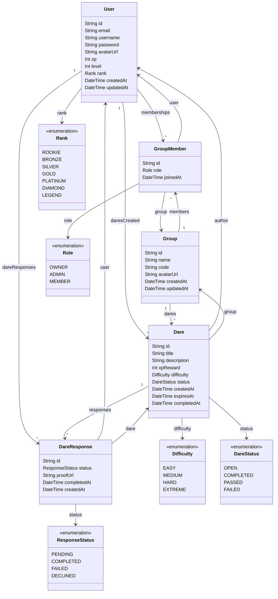

<h1 align="center">
  🎮 Dareo
</h1>

<p align="center">
  <strong>A gamified social dare platform — challenge your friends, earn XP, climb the leaderboard.</strong>
</p>

<p align="center">
  
  
  
  
  
  
  
  
  
  
  
  
</p>

---

## 📌 What is Dareo?

**Dareo** is a gamified social web app where friends create private groups and challenge each other with dares.

Players can create dares in their groups and **claim dares themselves** to earn XP. Each dare has a difficulty level and an XP reward. Players earn **XP** for completing dares, **level up** over time, and unlock **ranks** from Rookie to Legend.

> Friendly competition meets game-style progression in a dynamic, animated interface.

---

## ✨ Core Features

| Feature                 | Description                                                             |
| ----------------------- | ----------------------------------------------------------------------- |
| **Private Groups**      | Create or join invite-only groups using unique group codes              |
| **Create Dares**        | Create dares with title, description, difficulty, and XP reward         |
| **Self-Assign Dares**   | Members claim open dares themselves (+5 XP for accepting)               |
| **Complete Dares**      | Mark dares as completed to earn the dare's full XP reward               |
| **Pass / Fail**         | Pass or fail a dare — costs 200% of the dare's XP as a penalty          |
| **Edit & Delete Dares** | Authors can edit dare details or delete them entirely                   |
| **XP & Points System**  | Earn and lose XP based on dare outcomes                                 |
| **Level Progression**   | Level up every 10 XP — level = floor(XP / 10)                           |
| **Ranking System**      | 7 ranks from Rookie (0 XP) to Legend (700+ XP)                          |
| **Avatar Upload**       | Upload custom profile avatars via UploadThing cloud storage             |
| **Profile Editing**     | Edit username, email, and avatar from the profile page                  |
| **JWT Authentication**  | Secure auth with bcrypt password hashing and Bearer tokens              |
| **Zustand State**       | Global client state management with localStorage persistence            |
| **TanStack Query**      | Server state with automatic caching, refetching, and cache invalidation |
| **Error Boundary**      | Graceful error handling with styled fallback UI                         |
| **Suspense Loading**    | Smooth loading states with React Suspense fallbacks                     |
| **Protected Routes**    | Route guards redirect unauthenticated users to sign-in                  |
| **Responsive Design**   | Mobile-first UI with responsive breakpoints                             |
| **Game-style UI**       | Dark theme with glassmorphism, animations, and shadcn/ui components     |
| **Production Deployed** | Frontend on Vercel, API on Railway, DB on Supabase                      |

---

## 🎮 How the Game Works

### XP System

| Action                         | XP Change          |
| ------------------------------ | ------------------ |
| **Claim a dare** (self-assign) | +5 XP              |
| **Complete a dare**            | + dare's XP reward |
| **Pass a dare**                | −200% of dare's XP |
| **Fail a dare**                | −200% of dare's XP |

> XP can never go below 0.

### Difficulty & XP Caps

| Difficulty | Default XP | Max XP |
| ---------- | ---------- | ------ |
| Easy       | 10         | 25     |
| Medium     | 25         | 50     |
| Hard       | 50         | 100    |
| Extreme    | 100        | 200    |

### Leveling

Level is calculated as `floor(XP / 10)` with a minimum of level 1. To reach level 2 you need 20 XP, level 3 needs 30 XP, and so on.

### Ranking System

| Rank        | XP Required |
| ----------- | ----------- |
| 🟤 Rookie   | 0           |
| 🥉 Bronze   | 50          |
| 🥈 Silver   | 150         |
| 🥇 Gold     | 250         |
| 💎 Platinum | 350         |
| 💠 Diamond  | 500         |
| 👑 Legend   | 700         |

### Dare Lifecycle

```
Create Dare → Member Claims It (+5 XP) → Complete / Pass / Fail → XP Updated → Level & Rank Recalculated
```

### Dare Statuses

| Status      | Description                              |
| ----------- | ---------------------------------------- |
| `OPEN`      | Dare is available to be claimed          |
| `COMPLETED` | Assignee completed the dare — XP awarded |
| `PASSED`    | Assignee passed on the dare — XP penalty |
| `FAILED`    | Assignee failed the dare — XP penalty    |

---

## 🗂️ Data Model



---

## 🛠️ Tech Stack

### Frontend

| Technology                     | Purpose                                                              |
| ------------------------------ | -------------------------------------------------------------------- |
| **React 19**                   | UI library with hooks, Suspense, and component-based architecture    |
| **TypeScript 5.9**             | Type-safe development across the entire codebase                     |
| **Vite 7**                     | Build tool and dev server with HMR (Hot Module Replacement)          |
| **Tailwind CSS 4**             | Utility-first CSS framework with dark theme design                   |
| **shadcn/ui** (New York style) | 47 pre-built accessible UI components built on Radix UI primitives   |
| **Zustand 5**                  | Lightweight global state management (auth store)                     |
| **TanStack Query 5**           | Server state management — caching, mutations, query invalidation     |
| **React Router 7**             | Client-side routing with protected routes and `<Navigate>` redirects |
| **React Hook Form + Zod 4**    | Performant form handling with schema-based validation                |
| **Lucide React**               | Consistent icon library used across all pages                        |
| **UploadThing**                | Client-side file upload integration (avatar images)                  |

### Backend

| Technology                | Purpose                                                      |
| ------------------------- | ------------------------------------------------------------ |
| **Express 5**             | REST API server with route-based architecture                |
| **Prisma 7**              | Type-safe ORM with PostgreSQL adapter (`@prisma/adapter-pg`) |
| **PostgreSQL** (Supabase) | Cloud-hosted relational database                             |
| **JWT** (jsonwebtoken)    | Stateless authentication tokens                              |
| **bcryptjs**              | Secure password hashing with salt rounds                     |
| **UploadThing**           | Server-side file upload route handler                        |
| **CORS**                  | Cross-origin resource sharing with origin whitelist          |

### Testing

| Technology                      | Purpose                                                         |
| ------------------------------- | --------------------------------------------------------------- |
| **Vitest 4**                    | Test runner natively integrated with Vite's transform pipeline  |
| **React Testing Library**       | Component testing using DOM queries (no implementation details) |
| **@testing-library/user-event** | Realistic user interaction simulation                           |
| **@testing-library/jest-dom**   | Custom DOM assertion matchers                                   |
| **jsdom**                       | Browser environment simulation for Node.js tests                |

### Dev Tools

| Technology       | Purpose                                             |
| ---------------- | --------------------------------------------------- |
| **ESLint**       | Static code analysis and linting                    |
| **Prettier**     | Opinionated code formatting                         |
| **depcheck**     | Unused dependency detection (`npm run depcheck`)    |
| **tsx**          | TypeScript execution for the Express server         |
| **concurrently** | Parallel execution of client + server dev processes |

### Deployment & Infrastructure

| Technology      | Purpose                                    |
| --------------- | ------------------------------------------ |
| **Vercel**      | Frontend hosting with SPA routing rewrites |
| **Railway**     | Backend API hosting with automatic deploys |
| **Supabase**    | Managed PostgreSQL database hosting        |
| **UploadThing** | Cloud file storage for user avatars        |

---

## 🏗️ Architecture & Design

### Domain-Based Architecture

The app uses **feature/domain-based organisation** — not layer-based. Each feature owns all its own code. Cross-cutting code lives exclusively in `src/shared/`.

Data flows: Pages → Service Hooks → API Functions → `apiFetch()`

- **`shared/lib/api.ts`** — Centralized `apiFetch<T>()` with typed `ApiError` on non-2xx responses
- **`shared/services/*-api.ts`** — Pure async functions (no React imports) — testable and reusable
- **`shared/hooks/use-*-service.ts`** — TanStack Query wrappers adding caching, loading states, and cache invalidation
- **Pages** — Consume hooks directly, no manual fetch logic

### State Management

| Kind               | Tool                                                   | Manages                                                                              |
| ------------------ | ------------------------------------------------------ | ------------------------------------------------------------------------------------ |
| **Root context**   | **ThemeProvider** (`shared/context/theme-context.tsx`) | Dark/light theme — at root so every page, including pre-auth, can toggle             |
| **Root context**   | **AuthProvider** (`shared/context/auth-context.tsx`)   | Auth state bridged from Zustand — single API for all consumers                       |
| **Scoped context** | **GroupProvider** (`features/group/context/`)          | Group UI state (edit drawer, dialogs) — scoped to GroupPage only, preventing leakage |
| **Client state**   | **Zustand** (`shared/stores/auth-store.ts`)            | Auth (user, token, login/logout) — persisted to `localStorage`                       |
| **Server state**   | **TanStack Query** (`shared/hooks/use-*-service.ts`)   | Groups, dares, members — cached 30s, auto-refetches on mutations                     |

### Error Handling

- **ErrorBoundary** wraps the app — catches render errors with a styled fallback + "Try Again"
- **Suspense** shows a spinner during loading
- **ApiError** class normalizes all API failures with `status` + `message`
- **TanStack Query** retries failed queries once automatically

### Routing

| Path                  | Component    | Access                                     |
| --------------------- | ------------ | ------------------------------------------ |
| `/`                   | Landing page | Public (redirects to `/game` if logged in) |
| `/sign-in` `/sign-up` | Auth forms   | Public                                     |
| `/game`               | Dashboard    | 🔒 Protected                               |
| `/group/:id`          | Group detail | 🔒 Protected                               |
| `/profile`            | User profile | 🔒 Protected                               |

Protected routes redirect to `/sign-in` via `<Navigate replace />`. Provider hierarchy: `StrictMode → ThemeProvider → QueryClientProvider → BrowserRouter → AuthProvider → ErrorBoundary → Suspense → Routes` (ThemeProvider and AuthProvider implementations live in `shared/context/`).

### Authentication

Forms validated by **Zod** → `useSignIn()`/`useSignUp()` mutation → Express API (bcrypt + JWT) → Zustand `login()` saves token to `localStorage` → `ProtectedRoute` grants access.

### Styling

**Tailwind CSS 4** (dark theme, glassmorphism, animated gradients) + **shadcn/ui** (47 Radix-based components: Dialog, Drawer, Card, Avatar, Badge, etc.). All async buttons show `<Loader2>` spinner.

### Deployment

| Layer    | Platform        | URL                                       |
| -------- | --------------- | ----------------------------------------- |
| Frontend | **Vercel**      | `https://dareo.vercel.app`                |
| Backend  | **Railway**     | `https://dareo-production.up.railway.app` |
| Database | **Supabase**    | Managed PostgreSQL                        |
| Files    | **UploadThing** | Cloud avatar uploads                      |

`VITE_API_URL` baked at build time. CORS whitelist: `localhost:5173` + `dareo.vercel.app`. SPA routing via `vercel.json` rewrites.

---

## 📁 Project Structure

The frontend follows **domain-based (feature) organisation**. Each feature owns its page, components (modlets), and hooks. Cross-cutting code lives in `src/shared/`.

```
dareo/
├── .github/
│   └── workflows/
│       ├── ci.yml                  # CI: lint → prettier → typecheck → test on every PR
│       └── cd.yml                  # CD: build → deploy to GitHub Pages on push to main
├── prisma/
│   └── schema.prisma               # Database schema (models, enums, relations)
├── server/
│   ├── index.ts                    # Express server entry point
│   ├── app.ts                      # CORS, middleware, route registration
│   ├── db.ts                       # Prisma client with pg adapter
│   ├── uploadthing.ts              # File upload route handler
│   └── routes/
│       ├── auth.ts                 # POST /sign-up, /sign-in
│       ├── group.ts                # Groups, dares, claim/complete/delete
│       └── user.ts                 # PATCH profile
├── src/
│   ├── main.tsx                    # App entry — providers, router, routes
│   ├── App.tsx                     # Landing page (redirects if authenticated)
│   │
│   ├── features/                   # Domain-based feature modules (NOT layer-based)
│   │   ├── auth/
│   │   │   ├── sign-in-page.tsx        # Thin orchestrator modlet
│   │   │   ├── sign-in-page.test.tsx
│   │   │   ├── sign-up-page.tsx        # Thin orchestrator modlet
│   │   │   ├── auth.test.tsx
│   │   │   └── components/
│   │   │       ├── sign-in-form.tsx
│   │   │       ├── sign-up-form.tsx
│   │   │       ├── auth-navbar.tsx
│   │   │       ├── avatar-upload.tsx
│   │   │       └── auth-components.test.tsx
│   │   ├── game/
│   │   │   ├── game-page.tsx           # Dashboard orchestrator modlet
│   │   │   ├── game.test.tsx
│   │   │   └── components/
│   │   │       ├── stats-row.tsx
│   │   │       ├── group-card.tsx
│   │   │       ├── create-group-dialog.tsx
│   │   │       └── join-group-dialog.tsx
│   │   ├── group/
│   │   │   ├── group-page.tsx          # Group detail orchestrator modlet
│   │   │   ├── group.test.tsx
│   │   │   ├── constants.ts            # Difficulty colours, XP caps, role icons
│   │   │   ├── constants.test.ts
│   │   │   ├── context/
│   │   │   │   ├── group-context.tsx   # Scoped context — dialog state (GroupPage only)
│   │   │   │   └── group-context.test.tsx
│   │   │   ├── hooks/
│   │   │   │   ├── use-group-actions.ts    # Business logic: claim/complete/delete + XP
│   │   │   │   └── use-group-actions.test.ts
│   │   │   └── components/
│   │   │       ├── group-header.tsx
│   │   │       ├── member-list.tsx
│   │   │       ├── dare-list.tsx
│   │   │       ├── dare-card.tsx
│   │   │       ├── create-dare-dialog.tsx
│   │   │       ├── edit-dare-drawer.tsx
│   │   │       ├── dare-status-dialog.tsx
│   │   │       └── delete-dare-dialog.tsx
│   │   └── profile/
│   │       ├── profile-page.tsx        # Profile orchestrator modlet
│   │       ├── profile.test.tsx
│   │       ├── hooks/
│   │       │   ├── use-profile-edit.ts   # Edit state logic
│   │       │   └── use-profile-save.ts   # Avatar upload + profile patch
│   │       └── components/
│   │           ├── profile-header.tsx
│   │           ├── profile-stats.tsx
│   │           └── account-details.tsx
│   │
│   ├── shared/                     # All cross-cutting, domain-agnostic code
│   │   ├── components/
│   │   │   ├── navbar.tsx              # Auth-aware nav with XP badge
│   │   │   ├── navbar.test.tsx
│   │   │   ├── error-boundary.tsx      # App-level error fallback
│   │   │   ├── page-background.tsx     # Animated gradient backdrop
│   │   │   ├── page-footer.tsx         # Shared footer
│   │   │   ├── shared-components.test.tsx
│   │   │   └── ui/                     # 47 shadcn/ui primitives (Radix-based)
│   │   ├── context/
│   │   │   ├── auth-context.tsx        # Root context — bridges Zustand → React Context
│   │   │   ├── auth-context.test.tsx
│   │   │   ├── theme-context.tsx       # Root context — dark/light theme
│   │   │   └── theme-context.test.tsx
│   │   ├── hooks/
│   │   │   ├── use-mobile.ts           # Viewport breakpoint hook
│   │   │   ├── use-mobile.test.ts
│   │   │   ├── use-auth-service.ts     # useSignIn(), useSignUp()
│   │   │   ├── use-group-service.ts    # useGroups(), useCreateDare(), etc.
│   │   │   ├── use-user-service.ts     # useUpdateProfile()
│   │   │   └── service-hooks.test.tsx
│   │   ├── lib/
│   │   │   ├── api.ts                  # apiFetch<T>(), ApiError, API_URL
│   │   │   ├── api.test.ts
│   │   │   ├── auth.ts                 # Zod schemas + inferred types
│   │   │   ├── xp.ts                   # computeLevel(), computeRank()
│   │   │   ├── utils.ts                # cn() Tailwind merge helper
│   │   │   ├── uploadthing.ts          # UploadThing client hook
│   │   │   └── shared-lib.test.ts
│   │   ├── services/
│   │   │   ├── auth-api.ts             # signIn(), signUp()
│   │   │   ├── group-api.ts            # fetchGroups(), createDare(), claimDare(), etc.
│   │   │   ├── user-api.ts             # updateProfile()
│   │   │   └── services.test.ts
│   │   ├── stores/
│   │   │   ├── auth-store.ts           # Zustand auth state (user, token, login/logout)
│   │   │   └── auth-store.test.ts
│   │   └── types/
│   │       └── index.ts                # Barrel re-export of all domain types
│   │
│   ├── lib/                        # Thin barrels for shadcn compatibility (@/lib/utils)
│   │   ├── utils.ts  →  shared/lib/utils.ts
│   │   ├── api.ts    →  shared/lib/api.ts
│   │   ├── auth.ts   →  shared/lib/auth.ts
│   │   ├── xp.ts     →  shared/lib/xp.ts
│   │   └── uploadthing.ts → shared/lib/uploadthing.ts
│   └── test/
│       └── setup.ts                # Vitest + jest-dom setup
├── vercel.json                     # SPA rewrite rules
└── .env                            # Environment variables (not committed)
```

### Architecture layers

| Layer                  | Location                        | Rule                                  |
| ---------------------- | ------------------------------- | ------------------------------------- |
| **API functions**      | `shared/services/*-api.ts`      | Pure async, no React imports          |
| **Service hooks**      | `shared/hooks/use-*-service.ts` | TanStack Query wrappers only          |
| **Business hooks**     | `features/*/hooks/`             | Side-effects, derived state, no JSX   |
| **Scoped context**     | `features/*/context/`           | UI state shared within one feature    |
| **Root context**       | `shared/context/`               | App-wide state, mounted once at root  |
| **Components**         | `features/*/components/`        | Pure rendering, props in / events out |
| **Page orchestrators** | `features/*/*-page.tsx`         | Wires hooks to components, no logic   |

## 🚀 Getting Started

### Prerequisites

- **Node.js** 18+
- **PostgreSQL** database (or a Supabase project)

### Setup

```bash
# 1. Clone the repository
git clone https://github.com/xkhaliil/dareo.git
cd dareo

# 2. Install dependencies
npm install

# 3. Set up environment variables
#    Create a .env file with:
#    DATABASE_URL="postgresql://..."
#    JWT_SECRET="your-secret-key"
#    UPLOADTHING_TOKEN="your-uploadthing-token"
#    VITE_API_URL="http://localhost:3001"
#    VITE_BASE_PATH="/"   # set to "/<repo-name>/" for GitHub Pages

# 4. Push the database schema
npx prisma db push

# 5. Generate the Prisma client
npx prisma generate

# 6. Start the dev server (client + API)
npm run dev
```

> The client runs on `http://localhost:5173` and the Express API server runs on `http://localhost:3001`. The frontend uses `VITE_API_URL` to route API calls to the backend.

### Available Scripts

| Script               | Description                                                       |
| -------------------- | ----------------------------------------------------------------- |
| `npm run dev`        | Start both client and server in development mode (concurrently)   |
| `npm run dev:client` | Start only the Vite dev server                                    |
| `npm run dev:server` | Start only the Express API server (with tsx watch)                |
| `npm run build`      | Generate Prisma client, type-check, and build for production      |
| `npm run lint`       | Run ESLint across the codebase                                    |
| `npm test`           | Run all 69 tests once with Vitest                                 |
| `npm run test:watch` | Run tests in interactive watch mode                               |
| `npm run depcheck`   | Check for unused dependencies (with known false-positive ignores) |
| `npm run preview`    | Preview the production build locally                              |

---

## 🧪 Testing

The project uses **Vitest** with **React Testing Library** for a comprehensive test suite. Tests are co-located next to the files they test.

### Running Tests

```bash
# Run all tests
npm test

# Run tests in watch mode
npm run test:watch
```

### Test Infrastructure

- **Vitest** is configured with `jsdom` environment and integrated with Vite's transform pipeline, so tests share the same path aliases (`@/`), TypeScript config, and module resolution as the app.
- **`src/test/setup.ts`** loads `@testing-library/jest-dom/vitest` for DOM assertion matchers.
- Components that use **TanStack Query** hooks are wrapped in a `QueryClientProvider` with `retry: false` in tests to prevent flaky async behavior.
- **Zustand** store state is reset in `beforeEach` blocks to ensure test isolation.
- API calls are mocked at the `fetch` level using `vi.spyOn(globalThis, "fetch")`.

### Test Coverage

| Test File                                  | Type                        | Tests | Description                                                          |
| ------------------------------------------ | --------------------------- | ----- | -------------------------------------------------------------------- |
| `src/lib/xp.test.ts`                       | **Comprehensive unit**      | 23    | `computeLevel` & `computeRank` — all boundary values and edge cases  |
| `src/lib/auth.test.ts`                     | **Comprehensive unit**      | 13    | Zod schemas — username, email, password rules, mismatched passwords  |
| `src/components/navbar.test.tsx`           | **Comprehensive component** | 10    | Authenticated/unauthenticated states, links, XP badge, avatar        |
| `src/pages/sign-in.test.tsx`               | **Interactive component**   | 9     | Typing, password toggle, form submission, server/network errors      |
| `src/lib/utils.test.ts`                    | Unit                        | 5     | `cn()` class merging, deduplication, edge cases                      |
| `src/pages/smoke.test.tsx`                 | Smoke                       | 3     | SignUpPage, ProfilePage, GamePage render without crashing            |
| `src/shared/context/auth-context.test.tsx` | Integration                 | 3     | AuthProvider defaults, useAuth without provider, login updates state |
| `src/shared/hooks/use-mobile.test.ts`      | Unit                        | 2     | `useIsMobile` hook — desktop and mobile viewports                    |
| `src/App.test.tsx`                         | Smoke                       | 1     | Landing page renders                                                 |

**Total: 69 tests across 9 test files — all passing ✅**

---

## 📡 REST API Endpoints

All API routes are prefixed with `/api` and served by the Express 5 backend.

### Authentication (`/api/auth`)

| Method | Endpoint            | Description           | Auth |
| ------ | ------------------- | --------------------- | ---- |
| `POST` | `/api/auth/sign-up` | Register a new user   | No   |
| `POST` | `/api/auth/sign-in` | Login and receive JWT | No   |

### User (`/api/user`)

| Method  | Endpoint            | Description                       | Auth   |
| ------- | ------------------- | --------------------------------- | ------ |
| `PATCH` | `/api/user/profile` | Update username, email, or avatar | 🔒 JWT |

### Groups (`/api/groups`)

| Method | Endpoint           | Description                         | Auth   |
| ------ | ------------------ | ----------------------------------- | ------ |
| `GET`  | `/api/groups`      | List user's groups                  | 🔒 JWT |
| `POST` | `/api/groups`      | Create a new group                  | 🔒 JWT |
| `POST` | `/api/groups/join` | Join a group by code                | 🔒 JWT |
| `GET`  | `/api/groups/:id`  | Get group details (members + dares) | 🔒 JWT |

### Dares (`/api/groups/:id/dares`)

| Method   | Endpoint                                 | Description                                      | Auth   |
| -------- | ---------------------------------------- | ------------------------------------------------ | ------ |
| `POST`   | `/api/groups/:id/dares`                  | Create a new dare                                | 🔒 JWT |
| `PATCH`  | `/api/groups/:id/dares/:dareId`          | Edit a dare (title, description, difficulty, XP) | 🔒 JWT |
| `DELETE` | `/api/groups/:id/dares/:dareId`          | Delete a dare                                    | 🔒 JWT |
| `PATCH`  | `/api/groups/:id/dares/:dareId/claim`    | Claim (self-assign) a dare                       | 🔒 JWT |
| `PATCH`  | `/api/groups/:id/dares/:dareId/complete` | Complete/pass/fail a dare                        | 🔒 JWT |

### File Upload (`/api/uploadthing`)

| Method | Endpoint           | Description                         | Auth   |
| ------ | ------------------ | ----------------------------------- | ------ |
| `POST` | `/api/uploadthing` | Upload avatar image via UploadThing | 🔒 JWT |

---

## 🌟 Upcoming Features

- Daily streak rewards
- Random dare generator
- Anonymous dare mode
- Achievements & badges
- In-group chat
- Level-up sound effects
- Dark mode themes
- Double XP events
- AI-generated dare suggestions
- Global leaderboard across all groups
- Seasonal events & limited-time challenges

---

## 📄 License

This project is for educational purposes. Feel free to fork and build upon it!

---

<p align="center">
  Made with ❤️ and a lot of dares 🎲
</p>
