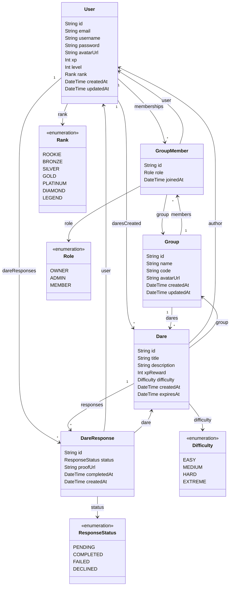

<h1 align="center">
  🎮 Dareo
</h1>

<p align="center">
  <strong>A gamified social dare platform — challenge your friends, earn XP, climb the leaderboard.</strong>
</p>

<p align="center">
  
  
  
  
  
</p>

---

## 📌 What is Dareo?

**Dareo** is a gamified social web app where friends create private groups and challenge each other with dares.

Each dare can be **directly assigned** to a specific player or **opened to group voting** to decide who must complete it. Players earn **XP** for completing dares, **level up** over time, and compete on a **group leaderboard**.

> Friendly competition meets game-style progression in a dynamic, animated interface.

---

## ✨ Core Features

| Feature | Description |
|---|---|
| 👥 **Private Groups** | Create or join invite-only groups with your friends |
| 🎯 **Create Dares** | Challenge specific members or the whole group |
| 🗳️ **Group Voting** | Let the group vote on who has to complete a dare |
| ⏳ **Vote Timer** | Voting phase with automatic assignment when time's up |
| ✅ **Dare Completion** | Mark dares done — validated by the group |
| ⭐ **XP System** | Earn XP for every dare you successfully complete |
| 📊 **Level Progression** | Level up and unlock new ranks as you gain XP |
| 🏆 **Leaderboard** | Dynamic in-group ranking updated in real time |
| 🎮 **Game-style UI** | Smooth animations and a game-inspired interface |

---

## 🎮 How the Game Works

```
Complete a dare  →  Earn XP  →  Level Up  →  Unlock new Rank  →  Climb the Leaderboard
```

- Voted dares may award **bonus XP**
- Leaderboard updates **dynamically** after each completion
- Levels determine your **rank title** within the group

---

## 🗂️ Data Model



---

## 🛠️ Tech Stack

| Layer | Technology |
|---|---|
| **Frontend** | React 19 + TypeScript |
| **Build Tool** | Vite 7 |
| **Styling** | Tailwind CSS |
| **Animations** | Framer Motion |
| **Backend / DB** | Firebase (Auth + Firestore) |
| **Linting** | ESLint + Prettier |

---

## 🚀 Getting Started

```bash
# 1. Clone the repository
git clone https://github.com/your-username/dareo.git
cd dareo

# 2. Install dependencies
npm install

# 3. Start the dev server
npm run dev
```

> Make sure to configure your Firebase credentials in a `.env` file before running.

---

## 🌟 Upcoming Features

- 🔥 Daily streak rewards
- 🎁 Random dare generator
- 🎭 Anonymous dare mode
- 🖼️ Photo proof uploads
- 🏅 Achievements & badges
- 💬 In-group chat
- 🎵 Level-up sound effects
- 📱 Fully responsive mobile-first design
- 🌙 Dark mode themes
- ⚡ Double XP events
- 🧠 AI-generated dare suggestions
- 📈 Global leaderboard across all groups
- 👑 Customizable avatars
- 🎟️ Seasonal events & limited-time challenges

---

## 📄 License

This project is for educational purposes. Feel free to fork and build upon it!

---

<p align="center">
  Made with ❤️ and a lot of dares 🎲
</p>
