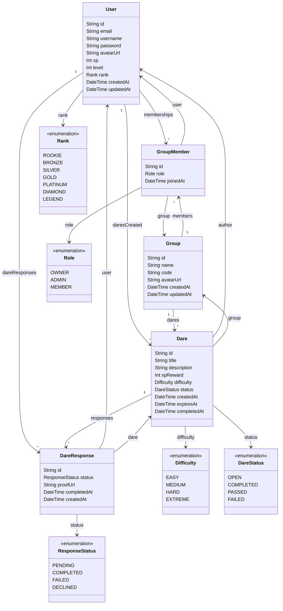

<h1 align="center">
  🎮 Dareo
</h1>

<p align="center">
  <strong>A gamified social dare platform — challenge your friends, earn XP, climb the leaderboard.</strong>
</p>

<p align="center">
  
  
  
  
  
  
  
  
  
  
  
  
</p>

---

## 📌 What is Dareo?

**Dareo** is a gamified social web app where friends create private groups and challenge each other with dares.

Players can create dares in their groups and **claim dares themselves** to earn XP. Each dare has a difficulty level and an XP reward. Players earn **XP** for completing dares, **level up** over time, and unlock **ranks** from Rookie to Legend.

> Friendly competition meets game-style progression in a dynamic, animated interface.

---

## ✨ Core Features

| Feature | Description |
|---|---|
| 👥 **Private Groups** | Create or join invite-only groups using unique group codes |
| 🎯 **Create Dares** | Create dares with title, description, difficulty, and XP reward |
| 🙋 **Self-Assign Dares** | Members claim open dares themselves (+5 XP for accepting) |
| ✅ **Complete Dares** | Mark dares as completed to earn the dare's full XP reward |
| ⏭️ **Pass / Fail** | Pass or fail a dare — costs 200% of the dare's XP as a penalty |
| ✏️ **Edit & Delete Dares** | Authors can edit dare details or delete them entirely |
| ⭐ **XP & Points System** | Earn and lose XP based on dare outcomes |
| 📊 **Level Progression** | Level up every 10 XP — level = floor(XP / 10) |
| 🏆 **Ranking System** | 7 ranks from Rookie (0 XP) to Legend (700+ XP) |
| 🖼️ **Avatar Upload** | Upload custom profile avatars via UploadThing cloud storage |
| ✏️ **Profile Editing** | Edit username, email, and avatar from the profile page |
| 🔐 **JWT Authentication** | Secure auth with bcrypt password hashing and Bearer tokens |
| 🧠 **Zustand State** | Global client state management with localStorage persistence |
| 🔄 **TanStack Query** | Server state with automatic caching, refetching, and cache invalidation |
| 🛡️ **Error Boundary** | Graceful error handling with styled fallback UI |
| ⏳ **Suspense Loading** | Smooth loading states with React Suspense fallbacks |
| 🔒 **Protected Routes** | Route guards redirect unauthenticated users to sign-in |
| 📱 **Responsive Design** | Mobile-first UI with responsive breakpoints |
| 🎮 **Game-style UI** | Dark theme with glassmorphism, animations, and shadcn/ui components |
| 🌐 **Production Deployed** | Frontend on Vercel, API on Railway, DB on Supabase |

---

## 🎮 How the Game Works

### XP System

| Action | XP Change |
|---|---|
| **Claim a dare** (self-assign) | +5 XP |
| **Complete a dare** | + dare's XP reward |
| **Pass a dare** | −200% of dare's XP |
| **Fail a dare** | −200% of dare's XP |

> XP can never go below 0.

### Difficulty & XP Caps

| Difficulty | Default XP | Max XP |
|---|---|---|
| Easy | 10 | 25 |
| Medium | 25 | 50 |
| Hard | 50 | 100 |
| Extreme | 100 | 200 |

### Leveling

Level is calculated as `floor(XP / 10)` with a minimum of level 1. To reach level 2 you need 20 XP, level 3 needs 30 XP, and so on.

### Ranking System

| Rank | XP Required |
|---|---|
| 🟤 Rookie | 0 |
| 🥉 Bronze | 50 |
| 🥈 Silver | 150 |
| 🥇 Gold | 250 |
| 💎 Platinum | 350 |
| 💠 Diamond | 500 |
| 👑 Legend | 700 |

### Dare Lifecycle

```
Create Dare → Member Claims It (+5 XP) → Complete / Pass / Fail → XP Updated → Level & Rank Recalculated
```

### Dare Statuses

| Status | Description |
|---|---|
| `OPEN` | Dare is available to be claimed |
| `COMPLETED` | Assignee completed the dare — XP awarded |
| `PASSED` | Assignee passed on the dare — XP penalty |
| `FAILED` | Assignee failed the dare — XP penalty |

---

## 🗂️ Data Model



---

## 🛠️ Tech Stack

### Frontend

| Technology | Purpose |
|---|---|
| **React 19** | UI library with hooks, Suspense, and component-based architecture |
| **TypeScript 5.9** | Type-safe development across the entire codebase |
| **Vite 7** | Build tool and dev server with HMR (Hot Module Replacement) |
| **Tailwind CSS 4** | Utility-first CSS framework with dark theme design |
| **shadcn/ui** (New York style) | 47 pre-built accessible UI components built on Radix UI primitives |
| **Zustand 5** | Lightweight global state management (auth store) |
| **TanStack Query 5** | Server state management — caching, mutations, query invalidation |
| **React Router 7** | Client-side routing with protected routes and `<Navigate>` redirects |
| **React Hook Form + Zod 4** | Performant form handling with schema-based validation |
| **Lucide React** | Consistent icon library used across all pages |
| **UploadThing** | Client-side file upload integration (avatar images) |
| **Recharts** | Chart components for data visualization |
| **Sonner** | Toast notification system |
| **Vaul** | Mobile-friendly drawer component |
| **Embla Carousel** | Touch-friendly carousel component |

### Backend

| Technology | Purpose |
|---|---|
| **Express 5** | REST API server with route-based architecture |
| **Prisma 7** | Type-safe ORM with PostgreSQL adapter (`@prisma/adapter-pg`) |
| **PostgreSQL** (Supabase) | Cloud-hosted relational database |
| **JWT** (jsonwebtoken) | Stateless authentication tokens |
| **bcryptjs** | Secure password hashing with salt rounds |
| **UploadThing** | Server-side file upload route handler |
| **CORS** | Cross-origin resource sharing with origin whitelist |

### Testing

| Technology | Purpose |
|---|---|
| **Vitest 4** | Test runner natively integrated with Vite's transform pipeline |
| **React Testing Library** | Component testing using DOM queries (no implementation details) |
| **@testing-library/user-event** | Realistic user interaction simulation |
| **@testing-library/jest-dom** | Custom DOM assertion matchers |
| **jsdom** | Browser environment simulation for Node.js tests |

### Dev Tools

| Technology | Purpose |
|---|---|
| **ESLint** | Static code analysis and linting |
| **Prettier** | Opinionated code formatting |
| **depcheck** | Unused dependency detection (`npm run depcheck`) |
| **tsx** | TypeScript execution for the Express server |
| **concurrently** | Parallel execution of client + server dev processes |

### Deployment & Infrastructure

| Technology | Purpose |
|---|---|
| **Vercel** | Frontend hosting with SPA routing rewrites |
| **Railway** | Backend API hosting with automatic deploys |
| **Supabase** | Managed PostgreSQL database hosting |
| **UploadThing** | Cloud file storage for user avatars |

---

## 🏗️ Architecture Overview

Dareo follows a **layered frontend architecture** that cleanly separates concerns across four layers, from raw HTTP calls up to UI components:

```
┌─────────────────────────────────────────────────────────┐
│                    UI Components                        │
│         (pages/  +  components/)                        │
│  React components consume hooks — zero fetch logic      │
├─────────────────────────────────────────────────────────┤
│                  Service Hooks                          │
│              (hooks/use-*-service.ts)                   │
│  TanStack Query wrappers: useQuery, useMutation         │
│  Auto-caching, invalidation, loading/error states       │
├─────────────────────────────────────────────────────────┤
│               Standalone API Functions                  │
│                   (services/*-api.ts)                   │
│  Pure async functions — no React, no hooks               │
│  Typed request/response, call apiFetch()                │
├─────────────────────────────────────────────────────────┤
│                  API Layer                              │
│                   (lib/api.ts)                          │
│  apiFetch<T>() — centralized fetch with error handling  │
│  ApiError class, authHeaders(), API_URL config          │
├─────────────────────────────────────────────────────────┤
│               Express REST API                          │
│               (server/routes/*.ts)                      │
│  JWT-protected endpoints, Prisma queries                │
├─────────────────────────────────────────────────────────┤
│                  Database                               │
│            Prisma ORM → PostgreSQL (Supabase)           │
└─────────────────────────────────────────────────────────┘
```

### How the layers connect

1. **`lib/api.ts`** exports a generic `apiFetch<T>(path, options)` function that prepends `API_URL`, parses JSON, and throws a typed `ApiError` on non-2xx responses.
2. **`services/*-api.ts`** files contain **standalone, pure async functions** (e.g., `signIn()`, `fetchGroups()`, `createDare()`). They call `apiFetch()` with the correct path, method, headers, and body. These functions are framework-agnostic — they have no React imports and can be tested or reused anywhere.
3. **`hooks/use-*-service.ts`** files wrap the standalone functions in **TanStack Query hooks** (`useQuery` for reads, `useMutation` for writes). They handle caching, background refetching, loading/error states, and automatic cache invalidation on mutations.
4. **Page components** call these hooks directly — they never write `fetch()` or manage loading booleans manually.

This separation means:
- API functions are **testable in isolation** (no React needed).
- TanStack Query handles all **caching, deduplication, and refetching** automatically.
- Components stay **thin and declarative** — they only handle UI rendering.

---

## 🧠 State Management

Dareo uses a **dual state management strategy** to handle two fundamentally different kinds of state:

### Client State → Zustand

**Zustand** manages application-level client state that doesn't come from the server — specifically, the **authentication state** (current user, JWT token, login/logout actions).

```
src/stores/auth-store.ts
```

The store is created with `zustand/create` and provides:
- `user` — the currently logged-in user object (`AuthUser | null`)
- `token` — the JWT string stored in `localStorage`
- `isAuthenticated` — derived boolean
- `login(token, user)` — saves to store + `localStorage`
- `logout()` — clears store + `localStorage`
- `updateUser(user)` — updates user data after profile edits

**Why Zustand over React Context?**
- Zustand stores are **global singletons** — no Provider wrapper needed (though we keep a thin `AuthProvider` for backward compatibility).
- **No unnecessary re-renders** — components subscribe to only the slices they need via selectors (e.g., `useAuthStore(s => s.token)`).
- State **persists across page navigations** without prop drilling.
- Works **outside of React** — service hooks can access the token directly.

### Server State → TanStack Query

**TanStack Query** manages all data that originates from the server — groups, dares, members, etc.

```
src/hooks/use-group-service.ts  →  useGroups(), useGroup(id), useCreateDare(), ...
src/hooks/use-auth-service.ts   →  useSignIn(), useSignUp()
src/hooks/use-user-service.ts   →  useUpdateProfile()
```

The `QueryClient` is configured in `main.tsx` with:
- **`retry: 1`** — one automatic retry on failure
- **`staleTime: 30s`** — cached data is fresh for 30 seconds before refetching

**How mutations keep data fresh:**
Every mutation hook calls `queryClient.invalidateQueries()` on success. For example, when `useCreateDare()` succeeds, it invalidates `["group", groupId]`, causing `useGroup()` to refetch automatically. This means the UI always reflects the latest server state without manual state synchronization.

### State flow diagram

```
User Action (click "Create Dare")
        │
        ▼
  useMutation (useCreateDare)
        │
        ├──→ calls createDare() from services/group-api.ts
        │         │
        │         ▼
        │    apiFetch() → Express API → Prisma → PostgreSQL
        │
        ▼  onSuccess:
  queryClient.invalidateQueries(["group", id])
        │
        ▼
  useQuery (useGroup) automatically refetches
        │
        ▼
  Component re-renders with fresh data
```

---

## 🔄 Data Fetching — Services-as-Hooks Pattern

Dareo implements the **Services-as-Hooks** pattern, which separates data fetching into three distinct layers:

### Layer 1 — Centralized API Client (`lib/api.ts`)

```typescript
export async function apiFetch<T>(path: string, options?: RequestInit): Promise<T> {
  const res = await fetch(`${API_URL}${path}`, options);
  const data = await res.json();
  if (!res.ok) throw new ApiError(res.status, data.error || "Something went wrong");
  return data as T;
}
```

- `API_URL` is read from `import.meta.env.VITE_API_URL` (baked at build time by Vite)
- All errors are normalized into `ApiError` objects with a `status` code and human-readable `message`
- `authHeaders(token)` helper adds the `Authorization: Bearer <token>` header

### Layer 2 — Standalone API Functions (`services/*-api.ts`)

| File | Functions | Description |
|---|---|---|
| `auth-api.ts` | `signIn()`, `signUp()` | Authentication endpoints |
| `group-api.ts` | `fetchGroups()`, `fetchGroup()`, `createGroup()`, `joinGroup()`, `createDare()`, `claimDare()`, `completeDare()`, `deleteDare()`, `editDare()` | All group & dare CRUD |
| `user-api.ts` | `updateProfile()` | Profile updates |

These are **pure async functions** — no React, no hooks, no side effects. They accept typed parameters and return typed responses. This makes them independently testable and reusable.

### Layer 3 — Service Hooks (`hooks/use-*-service.ts`)

| Hook | Type | Query Key | Invalidates |
|---|---|---|---|
| `useGroups()` | Query | `["groups"]` | — |
| `useGroup(id)` | Query | `["group", id]` | — |
| `useCreateGroup()` | Mutation | — | `["groups"]` |
| `useJoinGroup()` | Mutation | — | `["groups"]` |
| `useCreateDare(groupId)` | Mutation | — | `["group", groupId]` |
| `useClaimDare(groupId)` | Mutation | — | `["group", groupId]` |
| `useCompleteDare(groupId)` | Mutation | — | `["group", groupId]` |
| `useDeleteDare(groupId)` | Mutation | — | `["group", groupId]` |
| `useEditDare(groupId)` | Mutation | — | `["group", groupId]` |
| `useSignIn()` | Mutation | — | Calls `login()` on Zustand store |
| `useSignUp()` | Mutation | — | Calls `login()` on Zustand store |
| `useUpdateProfile()` | Mutation | — | Calls `updateUser()` on Zustand store |

Mutations automatically invalidate related queries so the UI stays in sync with the server.

---

## 🛡️ Error Handling & Resilience

Dareo implements a **multi-layered error handling strategy**:

### 1. ErrorBoundary (React class component)

Wraps the entire app in `main.tsx`. If any component throws during rendering, the `ErrorBoundary` catches it and displays a styled fallback card with the error message and a "Try Again" button that resets the error state.

```
<ErrorBoundary>
  <Suspense fallback={<PageLoader />}>
    <Routes>...</Routes>
  </Suspense>
</ErrorBoundary>
```

### 2. Suspense with Loading Fallback

React `<Suspense>` wraps all routes with a centered spinner (`PageLoader`) that displays while any lazy-loaded content or suspended component is resolving. This provides a smooth loading experience instead of blank screens.

### 3. API-Level Error Normalization

The `ApiError` class (extends `Error`) carries both a `status` code and a human-readable `message`. Every `apiFetch()` call throws an `ApiError` on non-2xx responses, making error handling consistent across the entire app:

```typescript
try {
  await signInMutation.mutateAsync({ email, password });
} catch (err) {
  // err.message contains the server's error message (e.g., "Invalid credentials")
  setServerError(err instanceof Error ? err.message : "Something went wrong");
}
```

### 4. TanStack Query Retry Logic

The `QueryClient` is configured with `retry: 1`, meaning failed queries automatically retry once before surfacing the error. This handles transient network issues gracefully.

---

## 🗺️ Routing & Navigation

### Route Definitions (`main.tsx`)

| Path | Component | Access | Description |
|---|---|---|---|
| `/` | `App` | Public | Landing page — redirects to `/game` if authenticated |
| `/sign-in` | `SignInPage` | Public | Sign-in form |
| `/sign-up` | `SignUpPage` | Public | Sign-up form with avatar upload |
| `/game` | `GamePage` | 🔒 Protected | Dashboard — list, create, and join groups |
| `/group/:id` | `GroupPage` | 🔒 Protected | Group detail — members, dares, CRUD operations |
| `/profile` | `ProfilePage` | 🔒 Protected | User profile — avatar, stats, edit functionality |

### Protected Routes

The `ProtectedRoute` component checks `useAuth().isAuthenticated`. If the user is not logged in, they are redirected to `/sign-in` using `<Navigate replace />`. This prevents unauthorized access to game pages.

### Provider Hierarchy

The app is wrapped in providers in a specific order, ensuring each layer has access to its dependencies:

```
<StrictMode>
  <QueryClientProvider>          ← TanStack Query cache
    <BrowserRouter>              ← React Router context
      <AuthProvider>             ← Auth state (Zustand-backed)
        <ErrorBoundary>          ← Catches render errors
          <Suspense>             ← Loading fallback
            <Routes />           ← Page routing
          </Suspense>
        </ErrorBoundary>
      </AuthProvider>
    </BrowserRouter>
  </QueryClientProvider>
</StrictMode>
```

---

## 🎨 Styling & UI Design

### Tailwind CSS 4

All styling uses **Tailwind CSS 4** utility classes — no custom CSS files per component. The design uses:

- **Dark theme** as the default with HSL CSS variables for colors
- **Glassmorphism effects** — `bg-card/50`, `backdrop-blur-sm`, semi-transparent borders (`border-border/50`)
- **Animated backgrounds** — large blurred gradient circles with `animate-pulse-glow` for a game-like atmosphere
- **Responsive design** — mobile-first layouts with Tailwind breakpoints
- **Custom animations** — fade-in, slide-up, and pulse-glow keyframes

### shadcn/ui Component Library

47 pre-built components from shadcn/ui (New York variant), built on **Radix UI** primitives for full accessibility (ARIA attributes, keyboard navigation, focus management):

- **Dialog** — Create group, create dare, confirm delete
- **Drawer** — Edit dare (mobile-friendly bottom sheet)
- **Card** — Group cards, profile card, dare cards, stats cards
- **Avatar** — User profile images with fallback initials
- **Badge** — XP display, rank badges, difficulty labels, dare status
- **Button** — Multiple variants (default, outline, destructive, ghost)
- **Input / Textarea / Select** — Form inputs with consistent styling
- **Alert Dialog** — Confirmation modals for destructive actions
- **Tooltip** — Contextual help on hover
- **Separator** — Visual dividers between sections

### Design Language

- **Color palette**: Purple/indigo gradients for backgrounds, amber/gold for XP, rank-specific colors (zinc → purple progression)
- **Typography**: Clean sans-serif with semantic font sizes
- **Spacing**: Consistent 4px-based spacing scale
- **Loading states**: Every button shows a `<Loader2>` spinner animation with disabled state during async operations
- **Empty states**: Illustrated empty states with call-to-action buttons when no groups or dares exist

---

## 🔐 Authentication Flow

```
1. User submits sign-up/sign-in form (validated by Zod schema)
        │
        ▼
2. useSignIn() / useSignUp() mutation calls services/auth-api.ts
        │
        ▼
3. apiFetch() sends POST to /api/auth/sign-in or /api/auth/sign-up
        │
        ▼
4. Express route validates, hashes password (bcrypt), creates/finds user (Prisma)
        │
        ▼
5. Server returns { token: JWT, user: AuthUser }
        │
        ▼
6. Mutation onSuccess → Zustand login(token, user) → saves to localStorage
        │
        ▼
7. useAuthStore.isAuthenticated = true → ProtectedRoute allows access
        │
        ▼
8. Navigate to /game
```

- **Passwords** are hashed with bcryptjs before storage — never stored in plain text.
- **JWT tokens** are signed with a secret key and sent as `Authorization: Bearer <token>` on every API request.
- **localStorage** persists the session so users stay logged in across browser refreshes.
- **Logout** clears the Zustand store and removes token/user from localStorage.

---

## 📋 Form Validation

Forms use **React Hook Form** with **Zod** schema resolvers for declarative, type-safe validation:

### Sign-In Schema
- Email: must be a valid email format
- Password: required, non-empty

### Sign-Up Schema
- Username: 3–20 characters, alphanumeric + underscores only
- Email: valid email format
- Password: minimum 8 characters, at least 1 uppercase letter, at least 1 number
- Confirm Password: must match password field

Validation errors appear inline beneath each field. Server-side errors (e.g., "Email already in use") display in a banner above the form.

---

## 🚀 Deployment

Dareo is deployed as a **split architecture** with the frontend and backend on separate platforms:

### Frontend → Vercel

- **Platform**: Vercel
- **URL**: `https://dareo.vercel.app`
- **Build command**: `prisma generate && tsc -b && vite build`
- **Output directory**: `dist`
- **SPA routing**: `vercel.json` configured with rewrites — all non-API routes serve `index.html`
- **Environment variable**: `VITE_API_URL` is set in Vercel's dashboard and baked into the JS bundle at build time

### Backend → Railway

- **Platform**: Railway
- **URL**: `https://dareo-production.up.railway.app`
- **Runtime**: Node.js with `tsx` executing TypeScript directly
- **Environment variables**: `DATABASE_URL`, `JWT_SECRET`, `UPLOADTHING_TOKEN`
- **Health check**: `GET /health` returns `{ status: "ok" }`

### CORS Configuration

The Express server uses a strict **origin whitelist**:

```typescript
cors({
  origin: ["http://localhost:5173", "https://dareo.vercel.app"],
  credentials: true,
})
```

Only the local dev server and the production Vercel domain are allowed to make cross-origin requests.

### Environment Variables

| Variable | Where | Purpose |
|---|---|---|
| `VITE_API_URL` | Vercel (build-time) | Frontend API base URL |
| `DATABASE_URL` | Railway | PostgreSQL connection string |
| `JWT_SECRET` | Railway | JWT signing secret |
| `UPLOADTHING_TOKEN` | Railway + Vercel | File upload authentication |

---

## 📁 Project Structure

```
dareo/
├── prisma/
│   └── schema.prisma              # Database schema (models, enums, relations)
├── server/
│   ├── index.ts                    # Express server entry point (port binding)
│   ├── app.ts                      # Express app config (CORS, middleware, routes)
│   ├── db.ts                       # Prisma client setup with pg adapter
│   ├── uploadthing.ts              # File upload route handler
│   └── routes/
│       ├── auth.ts                 # POST /sign-up, /sign-in — JWT auth
│       ├── group.ts                # CRUD groups, dares, claiming, status
│       └── user.ts                 # PATCH profile updates
├── src/
│   ├── main.tsx                    # Entry: QueryClientProvider, Router, Suspense, ErrorBoundary
│   ├── App.tsx                     # Landing page (redirects if authenticated)
│   ├── components/
│   │   ├── navbar.tsx              # Navigation bar (auth-aware, XP badge)
│   │   ├── error-boundary.tsx      # React ErrorBoundary with styled fallback
│   │   └── ui/                     # 47 shadcn/ui components (Radix UI primitives)
│   ├── stores/
│   │   └── auth-store.ts           # Zustand global auth state (user, token, login/logout)
│   ├── context/
│   │   └── auth-context.tsx        # Thin wrapper re-exporting from Zustand store
│   ├── services/
│   │   ├── auth-api.ts             # Standalone API fns: signIn(), signUp()
│   │   ├── group-api.ts            # Standalone API fns: fetchGroups(), createDare(), etc.
│   │   └── user-api.ts             # Standalone API fns: updateProfile()
│   ├── hooks/
│   │   ├── use-auth-service.ts     # TanStack Query mutations: useSignIn(), useSignUp()
│   │   ├── use-group-service.ts    # TanStack Query hooks: useGroups(), useCreateDare(), etc.
│   │   ├── use-user-service.ts     # TanStack Query mutation: useUpdateProfile()
│   │   └── use-mobile.ts           # Mobile breakpoint detection hook
│   ├── lib/
│   │   ├── api.ts                  # apiFetch<T>(), ApiError class, API_URL config
│   │   ├── auth.ts                 # Zod validation schemas (signUp, signIn)
│   │   ├── utils.ts                # Tailwind class merging utility (cn)
│   │   ├── xp.ts                   # Shared XP/level/rank calculation helpers
│   │   └── uploadthing.ts          # UploadThing React hook
│   ├── pages/
│   │   ├── game.tsx                # Dashboard — list/create/join groups
│   │   ├── group.tsx               # Group detail — members, dares, CRUD actions
│   │   ├── profile.tsx             # User profile — avatar, stats, editing
│   │   ├── sign-in.tsx             # Sign-in form (React Hook Form + Zod)
│   │   └── sign-up.tsx             # Sign-up form with avatar upload
│   └── test/
│       └── setup.ts                # Vitest test setup (jest-dom matchers)
├── generated/
│   └── prisma/                     # Auto-generated Prisma client & types
├── vercel.json                     # Vercel deployment config (SPA rewrites)
└── .env                            # Environment variables (not committed)
```

---

## 🚀 Getting Started

### Prerequisites

- **Node.js** 18+
- **PostgreSQL** database (or a Supabase project)

### Setup

```bash
# 1. Clone the repository
git clone https://github.com/xkhaliil/dareo.git
cd dareo

# 2. Install dependencies
npm install

# 3. Set up environment variables
#    Create a .env file with:
#    DATABASE_URL="postgresql://..."
#    JWT_SECRET="your-secret-key"
#    UPLOADTHING_TOKEN="your-uploadthing-token"
#    VITE_API_URL="http://localhost:3001"

# 4. Push the database schema
npx prisma db push

# 5. Generate the Prisma client
npx prisma generate

# 6. Start the dev server (client + API)
npm run dev
```

> The client runs on `http://localhost:5173` and the Express API server runs on `http://localhost:3001`. The frontend uses `VITE_API_URL` to route API calls to the backend.

### Available Scripts

| Script | Description |
|---|---|
| `npm run dev` | Start both client and server in development mode (concurrently) |
| `npm run dev:client` | Start only the Vite dev server |
| `npm run dev:server` | Start only the Express API server (with tsx watch) |
| `npm run build` | Generate Prisma client, type-check, and build for production |
| `npm run lint` | Run ESLint across the codebase |
| `npm test` | Run all 69 tests once with Vitest |
| `npm run test:watch` | Run tests in interactive watch mode |
| `npm run depcheck` | Check for unused dependencies (with known false-positive ignores) |
| `npm run preview` | Preview the production build locally |

---

## 🧪 Testing

The project uses **Vitest** with **React Testing Library** for a comprehensive test suite. Tests are co-located next to the files they test.

### Running Tests

```bash
# Run all tests
npm test

# Run tests in watch mode
npm run test:watch
```

### Test Infrastructure

- **Vitest** is configured with `jsdom` environment and integrated with Vite's transform pipeline, so tests share the same path aliases (`@/`), TypeScript config, and module resolution as the app.
- **`src/test/setup.ts`** loads `@testing-library/jest-dom/vitest` for DOM assertion matchers.
- Components that use **TanStack Query** hooks are wrapped in a `QueryClientProvider` with `retry: false` in tests to prevent flaky async behavior.
- **Zustand** store state is reset in `beforeEach` blocks to ensure test isolation.
- API calls are mocked at the `fetch` level using `vi.spyOn(globalThis, "fetch")`.

### Test Coverage

| Test File | Type | Tests | Description |
|---|---|---|---|
| `src/lib/xp.test.ts` | **Comprehensive unit** | 23 | `computeLevel` & `computeRank` — all boundary values and edge cases |
| `src/lib/auth.test.ts` | **Comprehensive unit** | 13 | Zod schemas — username, email, password rules, mismatched passwords |
| `src/components/navbar.test.tsx` | **Comprehensive component** | 10 | Authenticated/unauthenticated states, links, XP badge, avatar |
| `src/pages/sign-in.test.tsx` | **Interactive component** | 9 | Typing, password toggle, form submission, server/network errors |
| `src/lib/utils.test.ts` | Unit | 5 | `cn()` class merging, deduplication, edge cases |
| `src/pages/smoke.test.tsx` | Smoke | 3 | SignUpPage, ProfilePage, GamePage render without crashing |
| `src/context/auth-context.test.tsx` | Integration | 3 | AuthProvider defaults, useAuth without provider, login updates state |
| `src/hooks/use-mobile.test.ts` | Unit | 2 | `useIsMobile` hook — desktop and mobile viewports |
| `src/App.test.tsx` | Smoke | 1 | Landing page renders |

**Total: 69 tests across 9 test files — all passing ✅**

---

## 📡 REST API Endpoints

All API routes are prefixed with `/api` and served by the Express 5 backend.

### Authentication (`/api/auth`)

| Method | Endpoint | Description | Auth |
|---|---|---|---|
| `POST` | `/api/auth/sign-up` | Register a new user | No |
| `POST` | `/api/auth/sign-in` | Login and receive JWT | No |

### User (`/api/user`)

| Method | Endpoint | Description | Auth |
|---|---|---|---|
| `PATCH` | `/api/user/profile` | Update username, email, or avatar | 🔒 JWT |

### Groups (`/api/groups`)

| Method | Endpoint | Description | Auth |
|---|---|---|---|
| `GET` | `/api/groups` | List user's groups | 🔒 JWT |
| `POST` | `/api/groups` | Create a new group | 🔒 JWT |
| `POST` | `/api/groups/join` | Join a group by code | 🔒 JWT |
| `GET` | `/api/groups/:id` | Get group details (members + dares) | 🔒 JWT |

### Dares (`/api/groups/:id/dares`)

| Method | Endpoint | Description | Auth |
|---|---|---|---|
| `POST` | `/api/groups/:id/dares` | Create a new dare | 🔒 JWT |
| `PATCH` | `/api/groups/:id/dares/:dareId` | Edit a dare (title, description, difficulty, XP) | 🔒 JWT |
| `DELETE` | `/api/groups/:id/dares/:dareId` | Delete a dare | 🔒 JWT |
| `PATCH` | `/api/groups/:id/dares/:dareId/claim` | Claim (self-assign) a dare | 🔒 JWT |
| `PATCH` | `/api/groups/:id/dares/:dareId/complete` | Complete/pass/fail a dare | 🔒 JWT |

### File Upload (`/api/uploadthing`)

| Method | Endpoint | Description | Auth |
|---|---|---|---|
| `POST` | `/api/uploadthing` | Upload avatar image via UploadThing | 🔒 JWT |

---

## 🌟 Upcoming Features

-  Daily streak rewards
-  Random dare generator
-  Anonymous dare mode
-  Achievements & badges
-  In-group chat
-  Level-up sound effects
-  Dark mode themes
-  Double XP events
-  AI-generated dare suggestions
-  Global leaderboard across all groups
-  Seasonal events & limited-time challenges

---

## 📄 License

This project is for educational purposes. Feel free to fork and build upon it!

---

<p align="center">
  Made with ❤️ and a lot of dares 🎲
</p>
